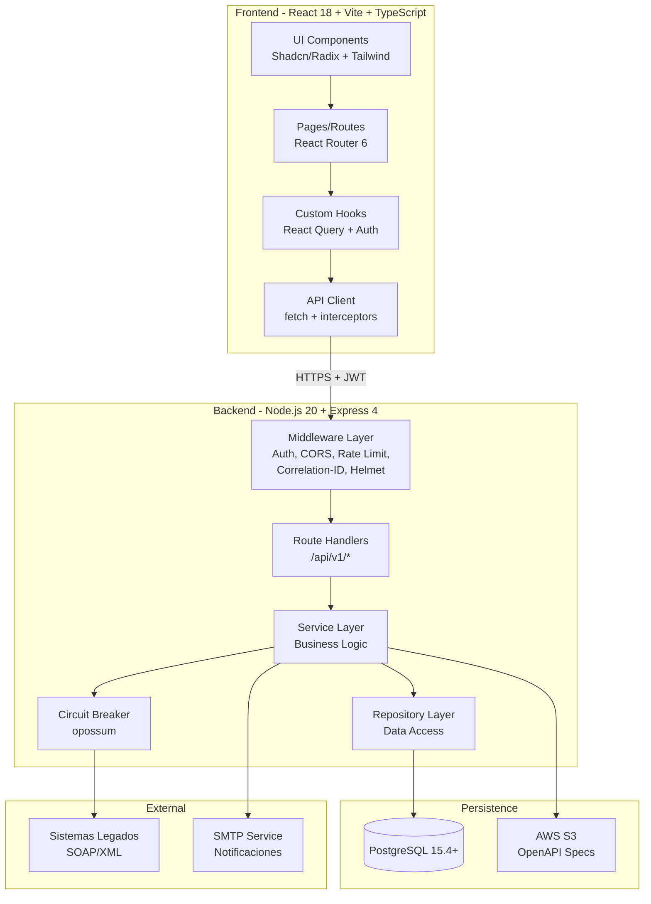
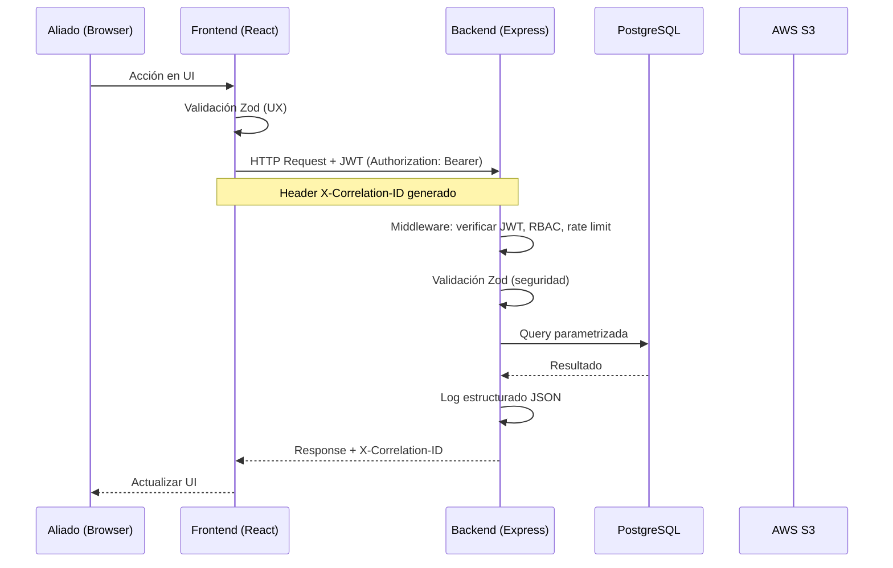
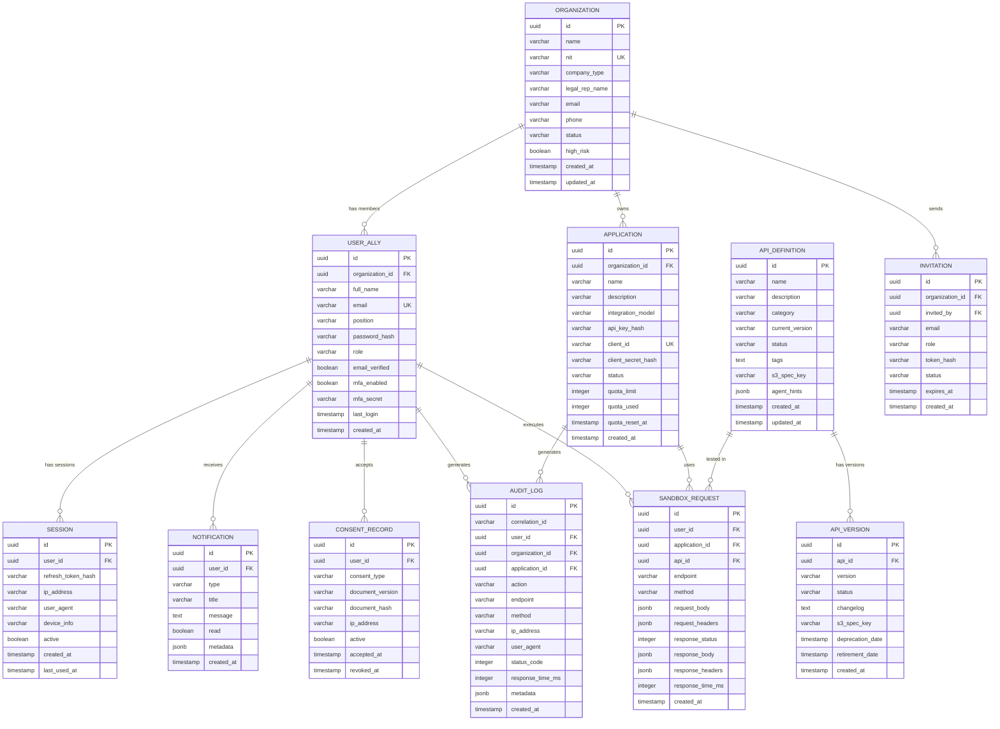

# Design Document — Conecta 2.0 API Ecosystem

## Overview

Conecta 2.0 es un portal de autoservicio empresarial que transforma la exposición de APIs de Seguros Bolívar de un repositorio estático a un ecosistema completo de Open Insurance. La plataforma permite a aliados (fintechs, e-commerce, bancos, marketplaces, intermediarios) registrarse, explorar APIs, probar en sandbox, monitorear consumo y gestionar equipos — todo desde una interfaz unificada.

### Alcance del Prototipo (Hackathon)

El prototipo se enfoca en las funcionalidades demostrables en vivo:

1. **Onboarding Wizard** — Registro guiado de aliados en 5 pasos
2. **Catálogo de APIs** — Exploración con filtros, renderizado OpenAPI, ejemplos multi-lenguaje
3. **Sandbox de Pruebas** — Formulario interactivo con ejecución y respuesta en tiempo real
4. **Dashboard de Consumo** — Métricas, alertas de cuota, gráficos de tendencia
5. **Panel de Administración** — Gestión centralizada de aliados y aplicaciones

Las funcionalidades de soporte (auditoría, versionamiento, adaptador legacy, MCP endpoint, consent management) se diseñan completas pero se implementan con datos mock donde sea necesario.

### Decisiones Arquitectónicas Clave

| Decisión | Elección | Rationale |
|----------|----------|-----------|
| Monorepo vs Polyrepo | Monorepo con carpetas `frontend/` y `backend/` | Simplicidad para hackathon, un solo `docker-compose` |
| ORM vs Query Builder | Sin ORM — queries parametrizadas con `pg` | Menos abstracción, control directo, cumple regla de parameterized queries |
| State Management | React Query (TanStack Query) para server state, React Context para UI state | Caché automático, refetch, sin boilerplate de Redux |
| Validación | Zod en frontend y backend (schemas compartidos) | TypeScript-first, reutilizable, genera tipos automáticamente |
| Autenticación | JWT (Access Token 15min) + httpOnly cookie (Refresh Token 7d) + OAuth 2.0 PKCE | Cumple reglas org: tokens en httpOnly, no localStorage |
| OpenAPI Parsing | `swagger-parser` (npm) para validación y dereferencing | Librería madura, soporta OpenAPI 3.x, validación incluida |
| Code Snippets | Generación en runtime desde OpenAPI spec | Sin dependencias extra, templates por lenguaje |
| Circuit Breaker | `opossum` (npm) | Librería ligera, bien mantenida, patrón estándar |

---

## Architecture

### Diagrama de Arquitectura General



### Separación de Capas (Regla Organizacional)

**Presentación (Frontend):**
- Renderizado de UI, eventos de usuario, navegación
- NUNCA lógica de negocio
- Validación de formularios con Zod (UX, no seguridad)
- Comunicación exclusiva vía API Client con interceptors para JWT refresh

**Lógica (Backend/API):**
- Reglas de dominio, validaciones de seguridad, autorización RBAC
- Servicios independientes por dominio (auth, catalog, sandbox, dashboard, admin)
- Middleware transversal: auth, rate limiting, correlation-id, logging

**Persistencia (Datos):**
- Acceso exclusivo vía Repository Layer, nunca directo desde frontend
- Queries parametrizadas con `pg` (driver nativo)
- OpenAPI specs almacenadas en S3, metadatos en PostgreSQL

### Estructura de Carpetas del Proyecto

```
conecta-2/
├── frontend/
│   ├── src/
│   │   ├── components/          # Componentes UI reutilizables (Shadcn)
│   │   ├── pages/               # Páginas por ruta
│   │   │   ├── onboarding/      # Wizard 5 pasos
│   │   │   ├── catalog/         # Catálogo y detalle de API
│   │   │   ├── sandbox/         # Sandbox interactivo
│   │   │   ├── dashboard/       # Dashboard de consumo
│   │   │   └── admin/           # Panel de administración
│   │   ├── hooks/               # Custom hooks (useAuth, useApi, etc.)
│   │   ├── lib/                 # Utilidades (api-client, openapi-parser, code-gen)
│   │   ├── schemas/             # Zod schemas compartidos
│   │   └── types/               # TypeScript types
│   ├── index.html
│   ├── vite.config.ts
│   └── package.json
├── backend/
│   ├── src/
│   │   ├── middleware/          # Auth, CORS, rate-limit, correlation-id, helmet
│   │   ├── routes/             # Express route handlers (/api/v1/*)
│   │   ├── services/           # Business logic por dominio
│   │   ├── repositories/       # Data access (queries parametrizadas)
│   │   ├── lib/                # Utilidades (circuit-breaker, logger, openapi-utils)
│   │   ├── schemas/            # Zod schemas de validación
│   │   └── types/              # TypeScript types
│   ├── migrations/             # SQL migrations
│   ├── seeds/                  # Datos iniciales y mock
│   └── package.json
├── shared/                     # Schemas Zod y types compartidos frontend/backend
├── docker-compose.yml
├── Dockerfile.frontend
├── Dockerfile.backend
└── README.md
```

### Flujo de Request (End-to-End)



---

## Components and Interfaces

### Frontend Components

#### 1. Onboarding Wizard (`/onboarding`)

| Componente | Responsabilidad |
|-----------|----------------|
| `OnboardingWizard` | Contenedor del wizard, gestión de pasos (1-5), estado del progreso |
| `StepCompanyInfo` | Paso 1: Formulario datos empresa (razón social, NIT, tipo, representante) |
| `StepEmailVerification` | Paso 2: Verificación de correo corporativo |
| `StepAccountCreation` | Paso 3: Creación cuenta Owner (nombre, cargo, contraseña, consentimientos) |
| `StepFirstApp` | Paso 4: Creación primera Aplicación (nombre, descripción, modelo integración) |
| `StepSummary` | Paso 5: Resumen y enlaces a Catálogo, Sandbox, docs |

#### 2. Catálogo de APIs (`/catalog`)

| Componente | Responsabilidad |
|-----------|----------------|
| `CatalogPage` | Lista de APIs con filtros (categoría, versión, estado) y búsqueda |
| `ApiCard` | Tarjeta resumen de API (nombre, categoría, versión, estado) |
| `ApiDetailPage` | Detalle de API: spec renderizada, endpoints, schemas |
| `OpenApiRenderer` | Renderizado interactivo de OpenAPI spec (endpoints colapsables, tablas params) |
| `CodeSnippets` | Fragmentos de código por lenguaje (JS, Python, cURL) con selector y botón copiar |

#### 3. Sandbox (`/sandbox/:apiId`)

| Componente | Responsabilidad |
|-----------|----------------|
| `SandboxPage` | Contenedor: selector de endpoint, formulario, respuesta |
| `RequestForm` | Formulario dinámico generado desde OpenAPI spec (params, headers, body) |
| `ResponseViewer` | Visualización de response (status, headers, body con syntax highlighting) |
| `RequestHistory` | Historial de solicitudes del aliado con replay |

#### 4. Dashboard de Consumo (`/dashboard`)

| Componente | Responsabilidad |
|-----------|----------------|
| `DashboardPage` | Métricas agregadas: llamadas, éxito, error, latencia |
| `QuotaAlert` | Alerta visual cuando consumo > 80% de cuota |
| `UsageChart` | Gráficos de tendencia (Recharts): por hora (24h), por día (30d) |
| `AppBreakdown` | Desglose por Aplicación y por endpoint |
| `DateRangePicker` | Selector de rango de fechas |

#### 5. Panel de Administración (`/admin`)

| Componente | Responsabilidad |
|-----------|----------------|
| `AdminDashboard` | Vista general: aliados, aplicaciones, métricas globales |
| `AllyManagement` | Lista de aliados con acciones (suspender, aprobar, buscar) |
| `AppManagement` | Gestión de aplicaciones (revocar keys, modificar cuotas) |
| `AuditLog` | Registros de auditoría con filtros y exportación CSV |
| `ApiVersionManager` | Publicación de versiones, planes de retiro |

### Backend API Endpoints

#### Auth y Onboarding (`/api/v1/auth`)

| Método | Endpoint | Descripción |
|--------|----------|-------------|
| POST | `/auth/register` | Paso 1: Registro organización + datos empresa |
| POST | `/auth/verify-email` | Paso 2: Verificar enlace de correo |
| POST | `/auth/create-account` | Paso 3: Crear cuenta Owner |
| POST | `/auth/login` | Login con email + password |
| POST | `/auth/magic-link` | Solicitar Magic Link |
| POST | `/auth/magic-link/verify` | Verificar Magic Link |
| POST | `/auth/refresh` | Refresh token (httpOnly cookie) |
| POST | `/auth/logout` | Cerrar sesión |
| POST | `/auth/mfa/verify` | Verificar código MFA |
| POST | `/auth/password/reset-request` | Solicitar reset de contraseña |
| POST | `/auth/password/reset` | Ejecutar reset de contraseña |

#### Catálogo (`/api/v1/catalog`)

| Método | Endpoint | Descripción |
|--------|----------|-------------|
| GET | `/catalog/apis` | Listar APIs con filtros (categoría, versión, estado) |
| GET | `/catalog/apis/:id` | Detalle de API con spec renderizada |
| GET | `/catalog/apis/:id/spec` | OpenAPI spec raw (JSON) |
| GET | `/catalog/apis/:id/snippets/:lang` | Fragmentos de código por lenguaje |
| GET | `/catalog/search?q=` | Búsqueda full-text en APIs |

#### Sandbox (`/api/v1/sandbox`)

| Método | Endpoint | Descripción |
|--------|----------|-------------|
| POST | `/sandbox/execute` | Ejecutar request en sandbox |
| GET | `/sandbox/history` | Historial de requests del aliado |
| GET | `/sandbox/mock-data/:apiId` | Datos mock para una API |

#### Dashboard (`/api/v1/dashboard`)

| Método | Endpoint | Descripción |
|--------|----------|-------------|
| GET | `/dashboard/metrics` | Métricas agregadas (24h default) |
| GET | `/dashboard/metrics/:appId` | Métricas por aplicación |
| GET | `/dashboard/usage/hourly` | Uso por hora (últimas 24h) |
| GET | `/dashboard/usage/daily` | Uso por día (últimos 30d) |
| GET | `/dashboard/quota/:appId` | Estado de cuota por aplicación |

#### Aplicaciones (`/api/v1/apps`)

| Método | Endpoint | Descripción |
|--------|----------|-------------|
| POST | `/apps` | Crear aplicación (genera API Key, Client ID/Secret) |
| GET | `/apps` | Listar aplicaciones de la organización |
| POST | `/apps/:id/regenerate-key` | Regenerar API Key (requiere MFA) |
| PATCH | `/apps/:id` | Actualizar aplicación |

#### Equipo (`/api/v1/team`)

| Método | Endpoint | Descripción |
|--------|----------|-------------|
| GET | `/team/members` | Listar miembros de la organización |
| POST | `/team/invite` | Enviar invitación |
| GET | `/team/invitations` | Listar invitaciones pendientes |
| PATCH | `/team/members/:id/role` | Cambiar rol (solo Owner) |
| DELETE | `/team/members/:id` | Eliminar miembro |
| POST | `/team/invite/:token/accept` | Aceptar invitación |

#### Admin (`/api/v1/admin`)

| Método | Endpoint | Descripción |
|--------|----------|-------------|
| GET | `/admin/allies` | Listar aliados con filtros |
| PATCH | `/admin/allies/:id/suspend` | Suspender aliado |
| PATCH | `/admin/allies/:id/approve` | Aprobar aliado pendiente |
| PATCH | `/admin/allies/:id/reject` | Rechazar aliado pendiente |
| GET | `/admin/audit` | Registros de auditoría con filtros |
| GET | `/admin/audit/export` | Exportar auditoría CSV |
| POST | `/admin/apis` | Publicar nueva versión de API |
| PATCH | `/admin/apis/:id/deprecate` | Iniciar plan de retiro |
| PATCH | `/admin/apps/:id/quota` | Modificar cuota de aplicación |
| PATCH | `/admin/apps/:id/revoke-key` | Revocar API Key |

#### Notificaciones (`/api/v1/notifications`)

| Método | Endpoint | Descripción |
|--------|----------|-------------|
| GET | `/notifications` | Listar notificaciones del usuario |
| PATCH | `/notifications/:id/read` | Marcar como leída |

#### Consent (`/api/v1/consent`)

| Método | Endpoint | Descripción |
|--------|----------|-------------|
| GET | `/consent` | Listar consentimientos del usuario |
| POST | `/consent/accept` | Aceptar consentimiento |
| POST | `/consent/revoke` | Revocar consentimiento |

#### MCP / Agent Experience (`/api/v1/mcp`)

| Método | Endpoint | Descripción |
|--------|----------|-------------|
| GET | `/mcp/tools` | Lista de APIs en formato MCP |

### Middleware Stack (orden de ejecución)

```
1. helmet()                    → Security headers (CSP, HSTS, X-Frame-Options, etc.)
2. cors()                      → CORS con orígenes permitidos
3. correlationId()             → Genera/propaga X-Correlation-ID
4. requestLogger()             → Log estructurado JSON de cada request
5. rateLimiter()               → Rate limiting por IP y API Key
6. express.json({ limit })     → Parse body con límite de tamaño
7. authenticate()              → Verificar JWT / API Key (rutas protegidas)
8. authorize(roles)            → Verificar RBAC (rutas con permisos)
9. validateSchema(zodSchema)   → Validar request body/params con Zod
10. [route handler]            → Lógica de negocio
11. auditLogger()              → Registro de auditoría post-response
12. errorHandler()             → Manejo centralizado de errores
```

---

## Data Models

### Diagrama Entidad-Relación



### Tablas Principales

#### `organizations`

| Columna | Tipo | Constraints | Descripción |
|---------|------|-------------|-------------|
| id | UUID | PK, DEFAULT gen_random_uuid() | Identificador único |
| name | VARCHAR(255) | NOT NULL | Razón social |
| nit | VARCHAR(15) | UNIQUE, NOT NULL | NIT con dígito de verificación |
| company_type | VARCHAR(50) | NOT NULL | fintech, e-commerce, banco, marketplace, intermediario, otro |
| legal_rep_name | VARCHAR(255) | NOT NULL | Nombre representante legal |
| email | VARCHAR(255) | NOT NULL | Correo corporativo |
| phone | VARCHAR(20) | | Teléfono de contacto |
| status | VARCHAR(20) | NOT NULL, DEFAULT 'pending_email' | pending_email, pending_approval, active, suspended, rejected |
| high_risk | BOOLEAN | DEFAULT false | Marcado por admin según SARLAFT |
| created_at | TIMESTAMPTZ | DEFAULT NOW() | |
| updated_at | TIMESTAMPTZ | DEFAULT NOW() | |

#### `user_allies`

| Columna | Tipo | Constraints | Descripción |
|---------|------|-------------|-------------|
| id | UUID | PK | |
| organization_id | UUID | FK → organizations.id, NOT NULL | |
| full_name | VARCHAR(255) | NOT NULL | |
| email | VARCHAR(255) | UNIQUE, NOT NULL | |
| position | VARCHAR(100) | | Cargo |
| password_hash | VARCHAR(255) | NOT NULL | bcrypt, cost factor >= 10 |
| role | VARCHAR(20) | NOT NULL | owner, admin, developer, viewer |
| email_verified | BOOLEAN | DEFAULT false | |
| mfa_enabled | BOOLEAN | DEFAULT false | |
| mfa_secret | VARCHAR(255) | | Encrypted TOTP secret |
| last_login | TIMESTAMPTZ | | |
| created_at | TIMESTAMPTZ | DEFAULT NOW() | |

#### `applications`

| Columna | Tipo | Constraints | Descripción |
|---------|------|-------------|-------------|
| id | UUID | PK | |
| organization_id | UUID | FK → organizations.id, NOT NULL | |
| name | VARCHAR(100) | NOT NULL | |
| description | TEXT | | |
| integration_model | VARCHAR(50) | NOT NULL | traditional, white_label, embedded |
| api_key_hash | VARCHAR(255) | NOT NULL | Hash de la API Key |
| client_id | VARCHAR(64) | UNIQUE, NOT NULL | |
| client_secret_hash | VARCHAR(255) | NOT NULL | |
| status | VARCHAR(20) | DEFAULT 'active' | active, suspended |
| quota_limit | INTEGER | DEFAULT 10000 | Llamadas por mes |
| quota_used | INTEGER | DEFAULT 0 | |
| quota_reset_at | TIMESTAMPTZ | NOT NULL | Próximo reset de cuota |
| created_at | TIMESTAMPTZ | DEFAULT NOW() | |

**Constraint:** Máximo 5 aplicaciones por organización (enforced en service layer con query count).

#### `audit_logs`

| Columna | Tipo | Constraints | Descripción |
|---------|------|-------------|-------------|
| id | UUID | PK | |
| correlation_id | VARCHAR(36) | NOT NULL, INDEX | |
| user_id | UUID | FK → user_allies.id | |
| organization_id | UUID | FK → organizations.id | |
| application_id | UUID | FK → applications.id | |
| action | VARCHAR(100) | NOT NULL | Tipo de acción |
| endpoint | VARCHAR(255) | | |
| method | VARCHAR(10) | | |
| ip_address | VARCHAR(45) | NOT NULL | IPv4 o IPv6 |
| user_agent | TEXT | | |
| status_code | INTEGER | | |
| response_time_ms | INTEGER | | |
| metadata | JSONB | | Datos adicionales |
| created_at | TIMESTAMPTZ | DEFAULT NOW(), INDEX | |

**Particionamiento:** Por mes en `created_at` para cumplir retención de 90 días en almacenamiento activo.

#### `consent_records`

| Columna | Tipo | Constraints | Descripción |
|---------|------|-------------|-------------|
| id | UUID | PK | |
| user_id | UUID | FK → user_allies.id, NOT NULL | |
| consent_type | VARCHAR(50) | NOT NULL | terms, habeas_data, data_usage |
| document_version | VARCHAR(20) | NOT NULL | |
| document_hash | VARCHAR(64) | NOT NULL | SHA-256 del documento |
| ip_address | VARCHAR(45) | NOT NULL | |
| active | BOOLEAN | DEFAULT true | |
| accepted_at | TIMESTAMPTZ | DEFAULT NOW() | |
| revoked_at | TIMESTAMPTZ | | |

**Retención:** 10 años conforme a regulación colombiana de Habeas Data. Tabla separada de archivado para registros mayores a 90 días.

### Índices Clave

```sql
-- Búsqueda de aliados por NIT
CREATE UNIQUE INDEX idx_organizations_nit ON organizations(nit);

-- Búsqueda de usuarios por email
CREATE UNIQUE INDEX idx_user_allies_email ON user_allies(email);

-- Auditoría por correlation_id y fecha
CREATE INDEX idx_audit_logs_correlation ON audit_logs(correlation_id);
CREATE INDEX idx_audit_logs_created ON audit_logs(created_at);
CREATE INDEX idx_audit_logs_org_date ON audit_logs(organization_id, created_at);

-- Catálogo: búsqueda full-text
CREATE INDEX idx_api_definitions_search ON api_definitions
  USING GIN(to_tsvector('spanish', name || ' ' || description || ' ' || COALESCE(tags, '')));

-- Consent records por usuario
CREATE INDEX idx_consent_user ON consent_records(user_id, consent_type);
```


---

## Correctness Properties

*A property is a characteristic or behavior that should hold true across all valid executions of a system — essentially, a formal statement about what the system should do. Properties serve as the bridge between human-readable specifications and machine-verifiable correctness guarantees.*

### Property 1: NIT Validation

*For any* string input, the NIT validator SHALL accept it if and only if it consists of exactly 9 digits followed by a valid check digit computed according to the Colombian NIT algorithm, and reject all other inputs with a descriptive error.

**Validates: Requirements 1.2**

### Property 2: Credential Uniqueness

*For any* two Applications created in the system (regardless of Organization), their generated API Keys, Client IDs, and Client Secrets SHALL be distinct from each other.

**Validates: Requirements 1.10, 1.12**

### Property 3: Application Limit Per Organization

*For any* Organization with N existing Applications where N >= 5, attempting to create a new Application SHALL be rejected, and the total count of Applications for that Organization SHALL remain at N.

**Validates: Requirements 1.13**

### Property 4: High-Risk Organization Status

*For any* Organization registration where the company type is configured as "high risk" (SARLAFT), the created Organization SHALL have status "pending_approval" instead of "active".

**Validates: Requirements 1.16**

### Property 5: Catalog Filtering Correctness

*For any* set of API definitions and any combination of filters (category, version, status), all APIs returned by the filter SHALL match every applied filter criterion, and no API matching all criteria SHALL be excluded from the results.

**Validates: Requirements 2.2, 7.5**

### Property 6: Search Returns Matching Results

*For any* search term that appears in an API's name, description, or tags, that API SHALL appear in the search results. No API whose name, description, and tags do not contain the search term SHALL appear in the results.

**Validates: Requirements 2.5**

### Property 7: Code Snippet Generation From OpenAPI

*For any* valid OpenAPI endpoint definition, the code snippet generator SHALL produce syntactically valid code in JavaScript (fetch/axios), Python (requests), and cURL that includes the correct HTTP method, URL path, required headers, and request body structure matching the OpenAPI schema.

**Validates: Requirements 2.4, 5.1, 5.3**

### Property 8: Sandbox Form Generation From OpenAPI

*For any* valid OpenAPI endpoint definition with parameters (path, query, header, body), the generated sandbox form SHALL contain input fields for every required parameter defined in the schema, with correct types and labels.

**Validates: Requirements 3.1**

### Property 9: Schema Validation Rejects Invalid Requests

*For any* request payload that violates the OpenAPI schema of an endpoint (missing required fields, wrong types, invalid formats), the validator SHALL reject the request and return specific error messages identifying each invalid field. *For any* request payload that conforms to the schema, the validator SHALL accept it.

**Validates: Requirements 3.5, 12.2**

### Property 10: Rate Limiting Enforcement

*For any* API Key with a configured rate limit of N requests per time window, the system SHALL allow the first N requests and reject request N+1 with status code 429 (Too Many Requests), including a Retry-After header.

**Validates: Requirements 3.6, 10.16**

### Property 11: Metrics Aggregation Correctness

*For any* set of audit log entries within a time range, the computed metrics SHALL satisfy: total_calls equals the count of entries, success_rate equals the count of 2xx entries divided by total, error_rate equals the count of 4xx/5xx entries divided by total, and average_latency equals the arithmetic mean of response_time_ms values. When grouped by hour or day, each bucket's metrics SHALL only include entries whose timestamp falls within that bucket.

**Validates: Requirements 4.1, 4.2, 4.4, 4.5**

### Property 12: Quota Alert Threshold

*For any* Application where quota_used / quota_limit exceeds 0.8, the dashboard response SHALL include an alert flag. *For any* Application where the ratio is 0.8 or below, no alert flag SHALL be present.

**Validates: Requirements 4.3**

### Property 13: Notification Targeting

*For any* API version publication or deprecation event, all Organizations that have at least one Application consuming that API SHALL receive a notification, and no Organization that does not consume the API SHALL receive one.

**Validates: Requirements 6.1, 6.2**

### Property 14: Deprecation Notice Timing

*For any* Plan_Retiro, the notification date SHALL be at least 90 days before the retirement date. *For any* maintenance window, the notification SHALL be at least 48 hours before the start time.

**Validates: Requirements 6.2, 6.3**

### Property 15: Ally Suspension Cascade

*For any* active Organization that is suspended by an Administrator, the Organization status SHALL change to "suspended", all API Keys of all Applications belonging to that Organization SHALL be invalidated, and an audit log entry SHALL be created recording the suspension action.

**Validates: Requirements 7.2**

### Property 16: API Key Revocation

*For any* API Key that is revoked, all subsequent requests using that key SHALL receive status code 403 (Forbidden), a new API Key SHALL be generated for the Application, and an audit log entry SHALL be created.

**Validates: Requirements 7.3, 10.15, 10.18**

### Property 17: Audit Log Completeness

*For any* API call or security event (authentication, key regeneration, role change, member management), the system SHALL create an immutable audit log entry containing: correlation_id, timestamp, user_id, organization_id, action, endpoint, method, ip_address, status_code, and response_time_ms.

**Validates: Requirements 8.1, 10.20, 15.13**

### Property 18: Audit Pagination

*For any* audit log query with pagination, each page SHALL contain at most 100 records (50 for team activity logs), and the records SHALL match all applied filters (ally, API, date range, status code).

**Validates: Requirements 8.2**

### Property 19: Correlation ID Propagation

*For any* HTTP request processed by the system, the response SHALL include an `X-Correlation-ID` header containing a valid UUID, and the same UUID SHALL appear in all audit log entries and structured log entries generated during that request's processing.

**Validates: Requirements 8.5, 11.3**

### Property 20: Retired API Rejection

*For any* API version with status "retired", all incoming requests to that version SHALL receive status code 410 (Gone) with a response body indicating the version is retired and suggesting the replacement version.

**Validates: Requirements 9.3**

### Property 21: Authentication Middleware

*For any* request to a protected endpoint that does not include a valid API Key in `X-API-Key` header or a valid JWT in `Authorization: Bearer` header, the system SHALL respond with status code 401 (Unauthorized) and a generic error message that does not reveal internal system details.

**Validates: Requirements 10.1, 10.2**

### Property 22: JWT Token Configuration

*For any* issued Access Token, the JWT `exp` claim SHALL be set to exactly 15 minutes from the `iat` claim. *For any* Refresh Token cookie, it SHALL have the attributes: httpOnly=true, Secure=true, SameSite=Strict, and Path restricted to the refresh endpoint.

**Validates: Requirements 10.4**

### Property 23: Refresh Token Rotation

*For any* Refresh Token that is used to obtain a new Access Token, the used Refresh Token SHALL be immediately invalidated (marked as used in the database), and a new Refresh Token SHALL be issued. Any attempt to reuse the invalidated Refresh Token SHALL fail with 401.

**Validates: Requirements 10.6**

### Property 24: Progressive Authentication Enforcement

*For any* operation classified at security level L (1=read catalog, 2=sandbox/dashboard, 3=sensitive ops), and any user session with completed authentication level A, the operation SHALL be allowed if A >= L and blocked with an authentication upgrade prompt if A < L.

**Validates: Requirements 10.7, 10.10**

### Property 25: Magic Link Validity

*For any* Magic Link token, it SHALL be accepted if and only if: (a) it has not been used before, (b) it was created less than 15 minutes ago, and (c) it corresponds to the email address of the requesting user. All other cases SHALL be rejected.

**Validates: Requirements 10.8**

### Property 26: Password Validation

*For any* password string shorter than 12 characters, the validator SHALL reject it. *For any* password string of 12 or more characters, the validator SHALL accept it (subject to HIBP check). The strength indicator SHALL classify passwords as: "weak" (12-15 chars, no variety), "acceptable" (16-19 chars or moderate variety), "strong" (20+ chars or high variety).

**Validates: Requirements 10.12, 10.13**

### Property 27: Auth Rate Limiting Escalation

*For any* IP address, after 5 failed authentication attempts within 5 minutes the system SHALL require CAPTCHA, after 10 failed attempts SHALL apply a 2-second incremental delay per attempt, and after 20 failed attempts SHALL block the IP for 15 minutes returning 429.

**Validates: Requirements 10.17**

### Property 28: Security Headers

*For any* HTTP response from the system, it SHALL include all of the following headers: Content-Security-Policy, X-Content-Type-Options (nosniff), X-Frame-Options (DENY), Strict-Transport-Security (max-age >= 31536000), and Referrer-Policy (strict-origin-when-cross-origin).

**Validates: Requirements 10.19**

### Property 29: Circuit Breaker State Machine

*For any* backend service, after 3 consecutive 5xx responses the Circuit Breaker SHALL transition to OPEN state (returning 503 to callers). While OPEN, it SHALL attempt one probe request every 30 seconds (HALF-OPEN). If the probe succeeds, it SHALL transition to CLOSED (normal operation). If the probe fails, it SHALL remain OPEN.

**Validates: Requirements 11.1, 11.2**

### Property 30: Structured Log Format

*For any* log entry emitted by the system, it SHALL be valid JSON containing all required fields: timestamp (ISO 8601), level, service, correlation_id, method, path, status_code, duration_ms, and message. *For any* request with duration_ms > 5000, the log level SHALL be "warn" or higher.

**Validates: Requirements 11.4, 11.5**

### Property 31: Legacy Adapter Round-Trip (JSON to SOAP to JSON)

*For any* valid JSON request payload that conforms to the OpenAPI schema of a legacy-backed API, translating it to SOAP/XML and then translating the SOAP response back to JSON SHALL preserve all data fields and their values without loss or corruption.

**Validates: Requirements 12.1**

### Property 32: SOAP Fault Translation

*For any* SOAP Fault response from a legacy system, the adapter SHALL translate it to a JSON error response with: status code 400 for client errors (SOAP Client fault), status code 502 for server errors (SOAP Server fault), and a descriptive error message.

**Validates: Requirements 12.3**

### Property 33: MCP Metadata Completeness

*For any* API published in the catalog, the MCP endpoint (`/api/v1/mcp/tools`) SHALL return an entry containing: name, description, parameters with types, request/response schemas, x-category, and at least one example of request/response.

**Validates: Requirements 13.1, 13.2, 13.3, 13.4**

### Property 34: OpenAPI Parse-Serialize Round-Trip

*For any* valid OpenAPI 3.x specification (JSON or YAML), parsing it into a structured object and then serializing it back to JSON SHALL produce a document that, when parsed again, yields an object deeply equal to the first parsed result. *For any* invalid OpenAPI document, the parser SHALL return an error indicating the location and type of the problem.

**Validates: Requirements 14.1, 14.2, 14.3, 14.4, 9.5**

### Property 35: RBAC Enforcement

*For any* user with a given role (Owner, Admin, Developer, Viewer) attempting any action, the system SHALL allow the action if and only if the role-permission matrix permits it: only Owner and Admin can create Applications, regenerate API Keys, and invite members; only Owner can transfer ownership, delete the Organization, or change an Admin's role. All other roles SHALL receive 403 Forbidden.

**Validates: Requirements 15.3, 7.6**

### Property 36: Invitation Token Validity

*For any* invitation token, it SHALL be accepted if and only if: (a) it has not been used before, (b) it was created less than 72 hours ago, and (c) the email is not already registered in another Organization. Upon acceptance, the created user SHALL have the role specified in the invitation and be linked to the correct Organization.

**Validates: Requirements 15.4, 15.5, 15.7**

### Property 37: Owner Self-Deletion Prevention

*For any* Organization where the Owner attempts to delete their own account, the system SHALL reject the operation if no other user with Admin role exists in the Organization to receive ownership transfer.

**Validates: Requirements 15.12**

### Property 38: Consent Record Completeness

*For any* consent acceptance event, the system SHALL create a Consent_Record containing: user_id, consent_type, document_version, document_hash (SHA-256), ip_address, and accepted_at timestamp. The document_hash SHALL match the SHA-256 hash of the actual document content at that version.

**Validates: Requirements 16.2**

### Property 39: Consent Version Update Flow

*For any* updated policy version, all active users SHALL receive a notification, and upon next login SHALL be blocked from accessing features until they accept or reject the new version. Users who reject SHALL have restricted access to features dependent on that consent.

**Validates: Requirements 16.3, 16.5**

---

## Error Handling

### Error Response Format

Todas las respuestas de error siguen un formato JSON estandarizado:

```json
{
  "error": {
    "code": "VALIDATION_ERROR",
    "message": "Descripción legible para el usuario",
    "details": [
      {
        "field": "nit",
        "message": "El NIT debe tener 9 dígitos más dígito de verificación"
      }
    ],
    "correlationId": "uuid-v4"
  }
}
```

### Códigos de Error por Capa

| Capa | Código HTTP | Código Error | Descripción |
|------|-------------|-------------|-------------|
| Validación | 400 | VALIDATION_ERROR | Request no cumple schema Zod |
| Autenticación | 401 | UNAUTHORIZED | JWT inválido, expirado o ausente |
| Autorización | 403 | FORBIDDEN | Rol insuficiente para la operación |
| No encontrado | 404 | NOT_FOUND | Recurso no existe |
| API retirada | 410 | API_RETIRED | Versión de API retirada |
| Rate limit | 429 | RATE_LIMITED | Límite de solicitudes excedido |
| Servidor | 500 | INTERNAL_ERROR | Error interno (sin detalles al cliente) |
| Circuit Breaker | 503 | SERVICE_UNAVAILABLE | Servicio backend no disponible |
| Legacy | 502 | BAD_GATEWAY | Error del sistema legado |

### Estrategia por Tipo de Error

**Errores de validación (400):**
- Zod parsea el request y retorna errores específicos por campo
- Frontend muestra errores inline en formularios
- Backend nunca confía en validación del frontend

**Errores de autenticación (401):**
- Mensaje genérico: "Credenciales inválidas" — nunca revelar si el email existe o no
- Interceptor del frontend intenta refresh automático antes de mostrar error
- Logging del evento de auth fallido en audit_logs

**Errores de autorización (403):**
- Verificación de rol en middleware `authorize(roles)`
- Mensaje: "No tiene permisos para esta operación"
- Log de intento de acceso no autorizado

**Errores internos (500):**
- Capturados por `errorHandler()` middleware centralizado
- Log completo con stack trace (solo en logs, nunca en response)
- Response al cliente: mensaje genérico + correlation_id para soporte

**Circuit Breaker (503):**
- Mensaje descriptivo: "El servicio está temporalmente no disponible. Intente en unos minutos."
- Header `Retry-After` con tiempo estimado
- Log de activación del circuit breaker

**Errores del adaptador legacy (502):**
- SOAP Faults traducidos a JSON con status code apropiado
- Detalles del error SOAP en metadata del audit log (no en response al cliente)

### Graceful Shutdown

El backend implementa graceful shutdown conforme a la regla organizacional:

1. Recibir señal SIGTERM
2. Dejar de aceptar nuevas conexiones
3. Esperar hasta 30 segundos para completar requests en curso
4. Cerrar conexiones a PostgreSQL y servicios externos
5. Salir con código 0

---

## Testing Strategy

### Enfoque Dual: Unit Tests + Property-Based Tests

La estrategia de testing combina dos enfoques complementarios:

- **Unit tests (Vitest):** Verifican ejemplos específicos, edge cases y flujos de integración entre componentes
- **Property-based tests (fast-check + Vitest):** Verifican propiedades universales que deben cumplirse para todos los inputs válidos

### Herramientas

| Herramienta | Versión | Propósito |
|-------------|---------|-----------|
| Vitest | 4.x | Test runner principal (ya configurado en el workspace) |
| fast-check | 4.x | Property-based testing (ya instalado como devDependency) |
| React Testing Library | 16.x | Testing de componentes React |
| Supertest | 7.x | Testing de endpoints HTTP (ya instalado) |

### Configuración de Property-Based Tests

Cada property test debe:
- Ejecutar un **mínimo de 100 iteraciones** (configuración de fast-check)
- Incluir un **comentario de referencia** al property del design document
- Formato del tag: `Feature: conecta-2-api-ecosystem, Property {number}: {title}`

Ejemplo de estructura:

```typescript
import { describe, it, expect } from 'vitest';
import fc from 'fast-check';

describe('Feature: conecta-2-api-ecosystem', () => {
  it('Property 1: NIT Validation', () => {
    // Feature: conecta-2-api-ecosystem, Property 1: NIT Validation
    fc.assert(
      fc.property(
        fc.string(),
        (input) => {
          const result = validateNIT(input);
          // ... property assertions
        }
      ),
      { numRuns: 100 }
    );
  });
});
```

### Distribución de Tests por Dominio

| Dominio | Unit Tests | Property Tests | Propiedades Cubiertas |
|---------|-----------|---------------|----------------------|
| NIT / Validación | Formatos válidos e inválidos | Validación universal de formato | P1 |
| Credenciales | Generación y hash | Unicidad de API Keys | P2 |
| Aplicaciones | CRUD, límites | Límite por org | P3 |
| Onboarding | Flujo wizard, estados | Estado alto riesgo | P4 |
| Catálogo | Listado, detalle | Filtros, búsqueda | P5, P6 |
| Code Snippets | Snippets por lenguaje | Generación desde OpenAPI | P7 |
| Sandbox | Ejecución, historial | Form generation, validación schema | P8, P9 |
| Rate Limiting | Límites fijos | Enforcement universal | P10 |
| Dashboard | Métricas, gráficos | Agregación correcta, alertas cuota | P11, P12 |
| Notificaciones | Envío, listado | Targeting, timing | P13, P14 |
| Admin | Suspensión, gestión | Cascada suspensión | P15 |
| API Keys | Revocación, regeneración | Revocación inmediata | P16 |
| Auditoría | Registros, exportación | Completeness, paginación, CSV | P17, P18 |
| Correlation ID | Propagación | UUID en todas las capas | P19 |
| Versionamiento | Publicación, retiro | Rechazo versiones retiradas | P20 |
| Auth | Login, JWT, refresh | Middleware, tokens, rotación | P21, P22, P23 |
| Auth Progresiva | Niveles, MFA | Enforcement por nivel | P24 |
| Magic Links | Generación, verificación | Validez temporal y uso único | P25 |
| Contraseñas | Hash, reset | Validación, fortaleza | P26 |
| Rate Limit Auth | Escalamiento | Tiers de bloqueo | P27 |
| Security Headers | Headers HTTP | Presencia en todas las respuestas | P28 |
| Circuit Breaker | Activación, recuperación | Máquina de estados | P29 |
| Logging | Formato, niveles | JSON estructurado | P30 |
| Legacy Adapter | Traducción JSON-SOAP | Round-trip, fault translation | P31, P32 |
| MCP | Endpoint, metadatos | Completeness | P33 |
| OpenAPI Parser | Parse, serialize | Round-trip | P34 |
| RBAC | Permisos por rol | Matriz rol-acción | P35 |
| Invitaciones | Envío, aceptación | Token validity, cross-org | P36 |
| Equipo | Gestión miembros | Owner self-deletion | P37 |
| Consent | Registros, revocación | Completeness, version flow | P38, P39 |

### Prioridad de Implementación (Hackathon)

**P0 — Críticos para demo:**
1. OpenAPI round-trip (P34) — base del catálogo y sandbox
2. NIT validation (P1) — onboarding wizard
3. Schema validation (P9) — sandbox funcional
4. Metrics aggregation (P11) — dashboard
5. RBAC enforcement (P35) — seguridad básica

**P1 — Importantes para completitud:**
6. Auth middleware (P21) + JWT config (P22)
7. Code snippet generation (P7)
8. Catalog filtering (P5) + search (P6)
9. Audit log completeness (P17)
10. Rate limiting (P10)

**P2 — Deseables:**
11-39: Resto de propiedades según tiempo disponible

### Tests de Integración (No PBT)

Los siguientes criterios se cubren con tests de integración example-based:

- Flujo completo de onboarding (wizard 5 pasos end-to-end)
- OAuth 2.0 PKCE flow
- Refresh token transparente
- Envío de correos (verificación, magic link, notificaciones)
- Exportación CSV de auditoría
- Renderizado HTML de OpenAPI specs
- Sesiones activas y cierre remoto

### Estructura de Archivos de Test

```
tests/
├── unit/
│   ├── validators/
│   │   ├── nit-validator.test.js          # P1
│   │   ├── password-validator.test.js     # P26
│   │   └── schema-validator.test.js       # P9
│   ├── services/
│   │   ├── credential-service.test.js     # P2, P3
│   │   ├── catalog-service.test.js        # P5, P6
│   │   ├── metrics-service.test.js        # P11, P12
│   │   └── auth-service.test.js           # P21-P25
│   ├── lib/
│   │   ├── openapi-parser.test.js         # P34
│   │   ├── code-generator.test.js         # P7
│   │   ├── circuit-breaker.test.js        # P29
│   │   ├── legacy-adapter.test.js         # P31, P32
│   │   └── logger.test.js                 # P30
│   ├── middleware/
│   │   ├── auth-middleware.test.js         # P21, P22
│   │   ├── rate-limiter.test.js           # P10, P27
│   │   ├── correlation-id.test.js         # P19
│   │   └── security-headers.test.js       # P28
│   └── rbac/
│       ├── rbac-enforcement.test.js       # P35
│       └── team-management.test.js        # P36, P37
└── integration/
    ├── onboarding-flow.test.js
    ├── sandbox-execution.test.js
    └── admin-operations.test.js
```
